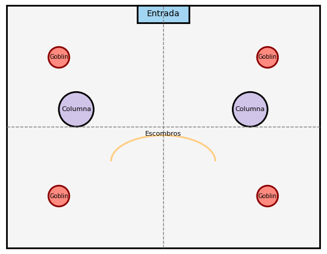
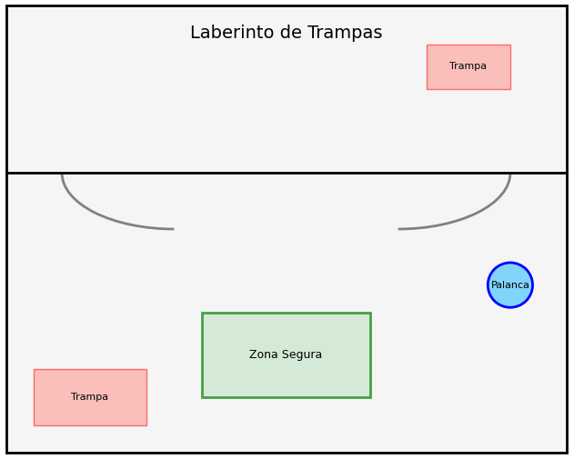
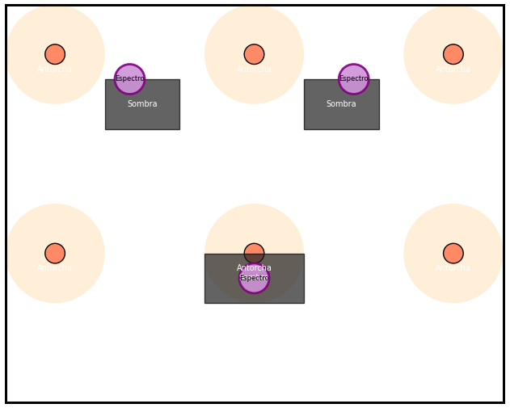
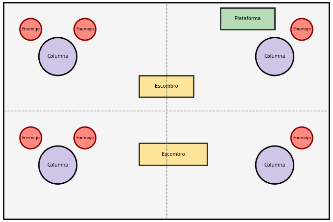
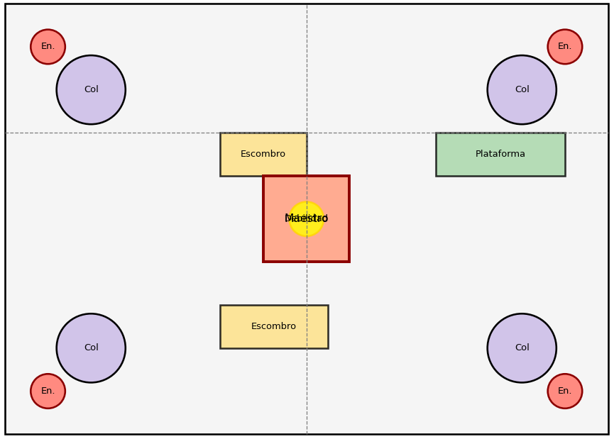

# La Torre del Estratega: Cinco Desafíos

## Introducción y Contexto

Los personajes son un grupo de aventureros contratados para ascender la enigmática Torre del Estratega, una estructura antigua llena de trampas, secretos y guardianes creados para probar la capacidad de adaptación y la astucia de quienes se atreven a desafiarla. Cada nivel presenta un reto único, obligando a los PJ a estudiar a sus enemigos, ajustar su equipo y aprovechar el entorno para sobrevivir.

**Este documento se basa en las reglas de D&D5.**

**En esta partida, se puede volver atrás en el tiempo para deshacer acciones.**

## Encuentro 1: El Umbral de la Torre

**Objetivo:** Familiarizarse con las mecánicas básicas de combate, la iniciativa y el uso del entorno.  

### Ambientación y enemigos

**Ambiente:** un vestíbulo en ruinas con columnas derruidas, zonas de cobertura y pasillos estrechos.

**Enemigos:** un grupo de guardianes menores (por ejemplo, goblins o kobolds) que patrullan el área de entrada.  
**Dinámica:**

- Introducir la importancia de la posición y la iniciativa.

- Permitir tiradas de ataque, salvación y pruebas de Destreza al desplazarse por un terreno irregular.

### Objetivo

El objetivo de este encuentro es que los jugadores se familiaricen con las mecánicas básicas de combate (iniciativa, tiradas de ataque y salvación) y experimenten el uso estratégico del terreno para obtener ventajas tácticas. Se enfatiza el posicionamiento y la importancia de utilizar coberturas naturales, como columnas y restos de la arquitectura derruida.

### Ambientación y Narrativa

Los personajes llegan a la imponente entrada de la Torre del Estratega. El vestíbulo está en ruinas, con columnas derrumbadas, paredes agrietadas y escombros esparcidos por el suelo. La luz que entra por las ventanas rotas crea contrastes marcados de sombra y claridad. Sin embargo, no están solos: un pequeño grupo de guardianes menores (por ejemplo, goblins o kobolds) ha establecido una patrulla para proteger el acceso.

**Narrativa sugerida:**  
*"Al cruzar el umbral, observan el eco de sus pasos resonar en la inmensidad de un vestíbulo olvidado por el tiempo. Columnas derruidas y escombros indican la antigua grandeza del lugar, pero algo se mueve en las sombras: figuras ágiles y nerviosas que se ocultan tras los restos, esperando el momento oportuno para atacar."*

### Enemigos

**Guardianes Menores:** 4 goblins (o kobolds, según la preferencia) que se despliegan en el área.

**Características:**

- **Defensa baja:** son rápidos pero poco coordinados.
- **Punto débil sugerido:** algunos pueden tener armaduras improvisadas que no protegen bien de ataques a distancia o de elementos precisos (ideal para que los jugadores exploren distintas estrategias).

### Dinámica del Encuentro

**Posicionamiento Inicial:**

- Los enemigos se sitúan en puntos estratégicos detrás de columnas o entre escombros.
- Los jugadores deben elegir si enfrentan a los enemigos de frente o utilizar el terreno para flanquearlos.

**Uso del Terreno:**

- Las columnas y escombros ofrecen cobertura que puede proporcionar bonificaciones a la defensa.
- Se pueden realizar tiradas de Destreza para moverse sin ser detectado o para reposicionarse durante el combate.

**Interacción con el Entorno:**

- Se pueden incluir elementos interactivos sencillos, como una gran puerta medio derrumbada que, al empujarla, puede entorpecer el avance de los enemigos o crear un obstáculo temporal.
- Los jugadores pueden realizar tiradas de Investigación o Percepción para identificar posibles puntos débiles en la formación enemiga o en el entorno (por ejemplo, una columna suelta que podría derrumbarse).

### Recompensas y Aprendizajes

**Aprendizaje de la iniciativa:** la rapidez para posicionarse puede determinar quién tiene la ventaja en el combate.

**Uso de la cobertura:** experimentar con coberturas naturales y comprender cómo influyen en la defensa y la ofensiva.

**Flexibilidad táctica:** incentivar a los jugadores a comunicarse y adaptarse según la situación, aprovechando cada elemento del escenario.

---

## Mapa Esquemático del Encuentro

**El contorno del vestíbulo:** Con un rectángulo de fondo.

**La entrada principal:** Señalada en la parte superior central.

**Columnas (cobertura):** Dibujadas como círculos en posiciones estratégicas.

**Posiciones de los goblins:** Indicadas por círculos de color distintivo.

**Elementos del entorno:** Líneas y curvas para representar muros derrumbados o barreras.

## Encuentro 2: El Laberinto de Trampas

**Objetivo:** Poner a prueba las habilidades de percepción, investigación y destreza para sortear trampas y acertijos.

**Ambiente:** Un pasillo laberíntico con mecanismos ocultos, trampas mecánicas y elementos interactivos (palancas, placas de presión).

**Desafíos**

- Trampas activadas por el peso o el movimiento, obligando a los jugadores a realizar tiradas de Destreza y Percepción.
- Un enigma o mecanismo que, al resolverse correctamente, desactiva parte de las trampas o abre un acceso seguro.  

**Dinámica:** Incentivar el uso de habilidades no combativas y la coordinación para que algunos personajes vigilen mientras otros exploran o desactivan las trampas.

### Objetivo

Este encuentro está diseñado para poner a prueba las habilidades de percepción, destreza y coordinación de los jugadores, obligándolos a sortear trampas mecánicas y resolver un enigma para avanzar sin activar peligros mayores. Se destaca la importancia de la observación y la cooperación para desactivar mecanismos y encontrar rutas seguras.

### Ambientación y narrativa

Los personajes se adentran en un pasillo laberíntico y oscuro, en el que el suelo, las paredes y el techo muestran signos de deterioro. A lo largo del recorrido, varios mecanismos ocultos y trampas esperan ser descubiertos. Entre ellos, unas placas de presión, pinchos ocultos y palancas que pueden modificar el entorno para desactivar o activar trampas.
*"El aire se vuelve más frío y tenso al internarse en este corredor abandonado. Las sombras se alargan y, en cada esquina, parece haber algo fuera de lugar. Una serie de inscripciones y mecanismos en las paredes insinúan que el camino es tan traicionero como enigmático.*

### Desafíos y Mecánicas

**Trampas activas:**

- Placas de presión en el suelo que al pisarlas pueden activar una lluvia de dardos o hacer caer pinchos.
- Trampas ocultas en las paredes, detectables con tiradas de Percepción o Investigación.

**Enigma mecánico:** Una palanca o serie de interruptores que, al activarse en el orden correcto, desactiva parte de las trampas y abre un pasaje seguro.

**Zona segura:** Un breve espacio en el laberinto que permite a los jugadores reagruparse y planificar su siguiente movimiento, fomentando la comunicación y la estrategia.

### Dinámica del Encuentro

**Exploración Cautelosa:** Los personajes deberán avanzar despacio, utilizando habilidades de Percepción e Investigación para identificar trampas antes de activarlas.

**Resolución de Enigma:** Al encontrar una serie de palancas o interruptores, se les presentará un enigma (por ejemplo, basarse en inscripciones antiguas o patrones en el entorno) que, al resolverse, desactiva las trampas más letales.

**Coordinación en Movimiento:** La disposición del laberinto favorecerá que algunos personajes se adelanten para comprobar la seguridad, mientras otros vigilan o se posicionan para ayudar a desactivar trampas en grupo.

### Recompensas y Aprendizajes

**Importancia de la Percepción:** Los jugadores aprenderán a valorar las tiradas de Percepción e Investigación para evitar daños y encontrar pistas.

**Resolución de Problemas:** La necesidad de resolver un enigma refuerza el juego en equipo y la aplicación creativa de habilidades.

**Gestión del Riesgo:** La planificación cuidadosa y el movimiento coordinado se vuelven esenciales para superar el recorrido sin caer en trampas fatales.

## Mapa Esquemático del Laberinto de Trampas

**Contorno del Laberinto:** Un gran rectángulo delimita el área del laberinto, representando las paredes exteriores.

**Camino Principal y Giros:** La línea central y las curvas (dibujadas con arcos) simulan el recorrido laberíntico que los personajes deben explorar.

**Trampas:** Las áreas en color rojo (con transparencia) indican zonas de riesgo, como placas de presión o trampas mecánicas.

**Zona Segura:** Un área marcada en verde pálido permite a los jugadores reagruparse y planificar sus movimientos.

**Elemento Interactivo:** Una palanca en color azul que simboliza el enigma mecánico que, al resolverse, desactiva algunas trampas.

## Encuentro 3: La emboscada de las sombras

**Objetivo:** Enfatizar la importancia del sigilo, la detección y el uso de la iluminación y el terreno a favor propio.  
**Ambientación y Enemigos:**

**Ambiente:** Un corredor oscuro iluminado solo por antorchas dispersas, con zonas de sombra donde se ocultan los peligros.

**Enemigos:** Criaturas etéreas o espectros que se mueven silenciosamente, aprovechando la oscuridad para atacar por sorpresa.  
**Dinámica:**

- Permitir tiradas de Sigilo, Percepción e Investigación para que los PJ descubran los patrones de ataque y la posición oculta de los enemigos.
- Incentivar el uso de hechizos o habilidades que generen luz o revelen lo oculto, evidenciando cómo el entorno puede volverse una ventaja táctica.

### Objetivo

En este encuentro, los personajes se adentran en un corredor oscuro donde la iluminación es escasa y la mayoría del espacio está sumido en sombras. El objetivo es enfatizar la importancia del sigilo, la percepción y el uso estratégico del entorno. Los jugadores deberán hacer tiradas de Sigilo y Percepción para detectar a los enemigos espectrales, que se ocultan en áreas de sombra, y utilizar la luz (por ejemplo, antorchas o hechizos) para disipar la oscuridad y revelar sus posiciones.

### Ambientación y narrativa

El grupo avanza por un pasillo de la torre donde el ambiente se torna inquietante. La única fuente de luz proviene de algunas antorchas dispersas en el corredor, generando manchas de luminosidad que contrastan fuertemente con las zonas en completa penumbra. En estas sombras, se esconden espectros que aprovechan la oscuridad para emboscar a los aventureros. La tensión aumenta mientras cada paso podría revelar un peligro oculto.

*"La penumbra se espesa a medida que avanzan por el corredor. Apenas unos haces de luz de las antorchas cortan la oscuridad, revelando formas vagamente humanas que se deslizan entre las sombras. ¿Serán capaces de descubrir la posición de estos espectros antes de que sus ataques les sorprendan?"*

### Enemigos

**Espectros:**

- Apariencia fantasmal, difuminados y etéreos.
- Se camuflan en las zonas de sombra, volviéndose difíciles de detectar a simple vista.
- Vulnerables a la luz y a ataques que aprovechen su falta de resistencia física.

### Dinámica del Encuentro

**Exploración en la oscuridad:** los personajes deberán avanzar con cautela, utilizando tiradas de Percepción y Sigilo para identificar las áreas donde se ocultan los espectros.

**Camina por la sombra:** se fomentará el uso de antorchas, hechizos de luz u otros recursos que puedan iluminar el entorno, revelando temporalmente a los enemigos ocultos.

**Ataques Sorpresa:** los espectros realizarán emboscadas aprovechando la oscuridad, lo que obligará a los jugadores a adaptarse rápidamente y a coordinarse para evitar ser superados.

### Recompensas y Aprendizajes

**Valoración de la Percepción:** la necesidad de identificar amenazas ocultas refuerza la importancia de las tiradas de Percepción.

**Uso Táctico de la Luz:** los jugadores aprenderán a utilizar elementos ambientales (como antorchas o hechizos) para transformar el terreno a su favor.

**Estrategia de Sigilo y Coordinación:** la combinación de movimientos cautelosos y acciones coordinadas será clave para superar la emboscada.

## Mapa del corredor oscuro

El siguiente código en Python utiliza matplotlib para generar un mapa elegante que representa el corredor oscuro con áreas iluminadas, zonas de sombra y posiciones de los espectros:

**Fondo oscuro:** El corredor está en penumbra, aunque en el mapa para imprimir sea blanco.

**Antorchas y áreas iluminadas:** Se ubican en puntos estratégicos para evidenciar cómo la luz disipa la oscuridad en áreas limitadas.

**Zonas de sombra:** Las áreas en negro intenso indican lugares donde los espectros se ocultan, obligando a los jugadores a actuar con cautela.

**Espectros:** Están marcados con círculos de tono púrpura, representando enemigos que se aprovechan de la oscuridad para emboscar.

## Encuentro 4: duelo táctico

**Objetivo:** Profundizar en la coordinación y la adaptación táctica, utilizando el terreno y la combinación de habilidades y equipo.

### **Ambientación y enemigos**

**Ambiente:** Una sala amplia con estructuras colapsadas, plataformas elevadas y zonas que obligan a maniobras precisas.

**Enemigos:** Un grupo de mercenarios o esqueletos reanimados organizados en formaciones, que se adaptan rápidamente al flujo del combate. 

#### **Dinámica**

Enfrentar a los jugadores a un combate dinámico donde cada posición y movimiento cuente.

Permitir que algunas áreas ofrezcan ventajas (como coberturas o puntos elevados) para ataques a distancia, obligando a que el grupo se coordine y aproveche el terreno para flanquear a los enemigos.

Posibilitar el ajuste del equipo entre enfrentamientos, permitiendo a los jugadores cambiar tácticas o preparar conjuros específicos en función de las debilidades observadas en los oponentes.

### Objetivo

El propósito de este encuentro es desafiar a los personajes a coordinar sus movimientos y acciones en un entorno dinámico. La sala cuenta con zonas elevadas, obstáculos derrumbados y áreas que obligan a maniobras precisas. Los jugadores deberán usar el terreno a su favor para flanquear a los enemigos, protegerse de ataques coordinados y adaptarse rápidamente a los cambios del combate.

### Ambientación y narrativa

Los aventureros se adentran en una sala amplia, antiguamente un gran salón o vestíbulo, que ahora se encuentra parcialmente derrumbada. Columnas caídas, muros agrietados y plataformas elevadas se intercalan en el espacio, creando áreas de cobertura y puntos estratégicos. En este ambiente caótico, un grupo de mercenarios o esqueletos reanimados se dispone en formaciones, listos para explotar cualquier debilidad en la coordinación de los PJ.

*"Al ingresar al gran salón, notan que el lugar parece haber sido testigo de épicas batallas pasadas. Columnas derrumbadas y escombros se mezclan con secciones aún en pie, ofreciendo oportunidades para moverse y atacar desde posiciones inesperadas. Los enemigos, organizados y letales, se mueven con rapidez, obligándolos a planificar cada acción con precisión."*

### Enemigos y dinámica de combate

**Enemigos:** un grupo de mercenarios o esqueletos reanimados, organizados en formaciones.

#### Dinámica

**Cobertura y Obstáculos:** el entorno ofrece numerosas coberturas: escombros, columnas caídas y plataformas elevadas que deben ser aprovechadas para protegerse o flanquear.

**Movilidad y Coordinación:** el combate se vuelve fluido, requiriendo constantes movimientos para evitar quedar expuestos.

**Adaptación del Terreno:** algunos obstáculos pueden moverse o derrumbarse tras ciertos impactos, cambiando la configuración del campo de batalla en pleno combate.

### Recompensas y Aprendizajes

**Coordinación de equipo:** Los jugadores deberán comunicarse y coordinar sus movimientos para maximizar el uso del terreno.

**Adaptación táctica:** Se enfatiza la importancia de ajustar estrategias en tiempo real, aprovechando las coberturas y anticipando el movimiento del enemigo.

**Uso del entorno:** Aprenderán a identificar puntos estratégicos que otorgan ventajas ofensivas y defensivas, como plataformas elevadas o barreras naturales.

## Mapa del Gran Salón

**Contorno del Gran Salón:** Representado por un gran rectángulo, define el área del combate.

**Obstáculos Internos:**

- **Columnas Derrumbadas:** Creadas como círculos, ofrecen cobertura y se sitúan en posiciones estratégicas.
- **Escombros:** Rectángulos que simulan áreas bloqueadas o que pueden servir de cobertura.
- **Plataforma Elevada:** Una zona diferenciada que otorga ventaja para ataques a distancia o para observar el campo de batalla.

**Líneas Divisorias:** Las líneas punteadas muestran muros derrumbados o zonas que separan áreas, obligando a los jugadores a adaptarse en sus movimientos.

**Posiciones de los Enemigos:** Los círculos rojos indican dónde se encuentran inicialmente los adversarios, promoviendo la necesidad de flanquear o coordinar ataques.

## Encuentro 5: El Enfrentamiento del Maestro de la Estrategia (Jefe Final)

**Objetivo:** Culminar la sesión con un desafío complejo que combine habilidades, estrategia en equipo y el aprovechamiento de debilidades específicas.  

### Ambientación y Enemigo

**Ambiente:** Una gran sala del trono con estructuras colapsadas, zonas de cobertura y elementos interactivos (por ejemplo, mecanismos que activen trampas a favor de los jugadores o en detrimento del jefe).

**Enemigo:** El Maestro de la Estrategia, un jefe con múltiples fases (por ejemplo, un caballero espectral o un hechicero caído) que usa tanto ataques a distancia como cuerpo a cuerpo.

### Objetivo

El objetivo de este encuentro es desafiar a los personajes con un jefe que evoluciona durante la batalla. El Maestro de la Estrategia (por ejemplo, un caballero espectral o un hechicero caído) posee varias fases:

**Fase Inicial:** Defiende sus ataques combinados, presentando un desafío moderado.

**Fase de Adaptación:** Al recibir cierto porcentaje de daño, activa habilidades especiales o convoca esbirros, dificultando el combate y ofreciendo pistas sobre su debilidad.

**Fase Final:** Durante un breve lapso, se expone una vulnerabilidad crítica que los jugadores deben explotar de manera coordinada para lograr la victoria.

### Ambientación y narrativa

El enfrentamiento tiene lugar en una gran sala del trono, antigua y majestuosa, pero ahora en ruinas. La sala presenta estructuras colapsadas, escombros y niveles de altura que permiten esconderse o posicionarse estratégicamente.

*"La gran sala del trono, que en su día albergó la gloria de un imperio, ahora es el escenario de un combate épico. El Maestro de la Estrategia se alza en el centro, rodeado de escombros y trampas mecánicas, mientras sus ataques y convocatorias de esbirros ponen a prueba la coordinación y el valor de los aventureros. En un parpadeo, se abre una oportunidad: una parte de su armadura brilla con una luz extraña. Este es el momento para unir fuerzas y atacar."*

### Dinámica del Encuentro

**Fase Inicial**

- El jefe utiliza ataques mixtos (a distancia y cuerpo a cuerpo) y mantiene una defensa moderada.
- Los jugadores deben aprender sus patrones de ataque y posicionarse estratégicamente aprovechando el entorno (columnas, escombros, niveles de altura).

**Fase de Adaptación**

- Al alcanzar un umbral de vida, el jefe activa una habilidad especial (por ejemplo, un aura que reduce el daño o convoca esbirros temporales).
- Se ofrecen indicios visuales de una vulnerabilidad: puede ser una parte de su armadura que se ilumina brevemente o un movimiento errático que deja un punto expuesto.

**Fase Final**

- La vulnerabilidad se revela durante un corto periodo, donde la coordinación y el ataque concentrado son decisivos.
- Los jugadores tienen que aprovechar todos los recursos adquiridos en encuentros previos (uso del entorno, habilidades de percepción y coordinación en equipo).

### Recompensas y aprendizajes

**Coordinación y comunicación:** La necesidad de coordinar ataques y defenderse simultáneamente enfatiza el trabajo en equipo.

**Adaptabilidad táctica:** Los jugadores aprenderán a adaptarse a cambios rápidos en la situación de combate, analizando pistas y ajustando estrategias en tiempo real.

**Uso Integral del entorno:** La sala del trono, con sus múltiples niveles y obstáculos, ofrece oportunidades para posicionarse, cubrirse y atacar desde ángulos inesperados.

## Mapa de la Sala del Trono (encuentro final)

**Contorno de la Sala:** Un gran rectángulo define el espacio del combate, simulando las paredes y la estructura de la antigua sala del trono.

**Columnas y Escombros:** Se representan con círculos y rectángulos que actúan como cobertura o barreras estratégicas.

**Plataforma Elevada:** una zona diferenciada que ofrece ventajas tácticas, ideal para ataques a distancia o para tener una mejor visión del campo.

**El jefe final:** ubicado en el centro, se representa con un rectángulo y se le añade un círculo indicador (vulnerabilidad) que señala el momento crítico de la batalla.

**Esbirros y muros internos:** líneas punteadas y posiciones de enemigos secundarios complementan la dinámica del combate, obligando a los jugadores a gestionar múltiples amenazas y aprovechar el entorno.

# Enemigos

## 1. Guardián goblin

*(Encuentro 1: El Umbral de la Torre)*

**Descripción:**
Estos goblins actúan como guardianes menores en la entrada de la torre. Son rápidos, escurridizos y aprovechan el terreno en ruinas para emboscar a los aventureros.

**Estadísticas:**

- **Clase de Armadura (CA):** 15 (ligera armadura, aprovechando su agilidad)
- **Puntos de Golpe (PG):** 7 (2d6)
- **Velocidad:** 30 pies

**Atributos:**

| FUE    | DES     | CON | INT | SAB    | CAR    |
|:------:|:-------:|:---:|:---:|:------:|:------:|
| 8 (-1) | 14 (+2) | 10  | 10  | 8 (-1) | 8 (-1) |

**Habilidades:** Sigilo +6, Percepción +2

**Sentidos:** Visión en la oscuridad 60 pies; Percepción pasiva 11

**Idiomas:** Común, Goblin

**Ataques:**

- **Cimitarra:**
  - *Ataque cuerpo a cuerpo:* +4 al golpe, alcance 5 pies, un objetivo.
  - *Impacto:* 5 (1d6 + 2) daño cortante.
- **Arco Corto:**
  - *Ataque a distancia:* +4 al golpe, alcance 80/320 pies, un objetivo.
  - *Impacto:* 5 (1d6 + 2) daño perforante.

**Habilidad Especial:**

- **Escape Ágil:** Puede tomar la acción de Desenganche o Esconderse como acción adicional en cada uno de sus turnos, lo que le permite reposicionarse rápidamente y aprovechar su entorno.

## 2. Trampas del laberinto

*(Encuentro 2: El Laberinto de Trampas)*

Aunque no son "enemigos vivos", las trampas representan amenazas letales. Aquí dos ejemplos de trampas mecánicas:

### a) Trampa de placas de presión (Dardos Ocultos)

- **Detección:** Tirada de Percepción DC 13 para notar irregularidades en el suelo.
- **Desarme:** Prueba de Herramientas de ladrón o Destreza DC 13.
- **Efecto:**
  - Al activarse, dispara dardos desde las paredes.
  - Cada criatura en un área de 5×5 pies debe realizar una tirada de Destreza DC 13.
  - En fallo, recibe 2d6 de daño perforante; con éxito, la mitad.

### b) Trampa de pinchos

- **Detección:** Tirada de Percepción DC 15 para descubrir la sección debilitada del suelo.
- **Desarme:** Prueba de Destreza DC 15.
- **Efecto:**
  - Al activarse, el suelo se abre y revela pinchos afilados.
  - Las criaturas en el área deben hacer una tirada de Destreza DC 15.
  - En fallo, reciben 3d6 de daño perforante; con éxito, la mitad.

## 3. Espectro Sombrío

*(Encuentro 3: La Emboscada de las Sombras)*

**Descripción:**  
Seres etéreos que se ocultan en la penumbra, emboscando a los personajes. Su forma difusa y su vínculo con la oscuridad les hacen difíciles de combatir, salvo que se expongan a luz intensa.

**Estadísticas:**

- **CA:** 12
- **PG:** 22 (5d8)
- **Velocidad:** 0 pies (terrestre); Vuelo 50 pies (flotando)

**Atributos:**

| FUE    | DES     | CON | INT | SAB     | CAR     |
|:------:|:-------:|:---:|:---:|:-------:|:-------:|
| 6 (-2) | 14 (+2) | 10  | 10  | 12 (+1) | 17 (+3) |

**Habilidades y Sentidos:**

- **Resistencias:**
  - Resiste daños de armas no mágicas (bludgeoning, perforante y cortante).
  - Inmunidad al daño necrótico y al veneno; inmunidades a condiciones (envenenado, paralizado, etc.).
- **Sentidos:** Visión en la oscuridad 60 pies; Percepción pasiva 11
- **Idiomas:** Entiende los idiomas que conocía en vida, pero no puede hablar.
- **Desafío:** 1 (200 XP)

**Ataque: Drenaje Vital**

- *Ataque cuerpo a cuerpo:* +4 al golpe, alcance 5 pies, un objetivo.
- *Impacto:* 10 (2d6 + 3) daño necrótico.
- *Efecto Adicional:* La criatura impactada debe superar una salvación de Constitución DC 10 o reducirse sus puntos de golpe máximos en la cantidad de daño infligido.

**Habilidad Adicional:**

- **Vulnerabilidad a la Luz:** Si se expone a luz brillante (por ejemplo, mediante un hechizo o una fuente de luz intensa), el espectro recibe 1d6 de daño adicional por cada ataque exitoso que lo impacte.

## 4. Mercenario Esquelético

*(Encuentro 4: El Duelo Táctico)*

**Descripción:**  
Estos combatientes reanimados son soldados caídos que han vuelto a la lucha. Son menos resistentes que otros no-muertos, pero su coordinación táctica los hace peligrosos en grupo.

**Estadísticas:**

- **CA:** 13 (Armadura natural)
- **PG:** 13 (2d8 + 4)
- **Velocidad:** 30 pies

**Atributos:**

| FUE | DES     | CON     | INT    | SAB    | CAR    |
|:---:|:-------:|:-------:|:------:|:------:|:------:|
| 10  | 14 (+2) | 15 (+2) | 6 (-2) | 8 (-1) | 5 (-3) |

**Habilidades y Sentidos:**

- **Vulnerabilidad:** Reciben daño contundente adicional.
- **Ataques:**
  - **Espada Corta:**
    - *Ataque cuerpo a cuerpo:* +4 al golpe, alcance 5 pies.
    - *Impacto:* 1d6 + 2 daño cortante.
  - **Arco Corto:**
    - *Ataque a distancia:* +4 al golpe, alcance 80/320 pies.
    - *Impacto:* 1d6 + 2 daño perforante.
- **Habilidad Especial – Golpe Coordinado:**
  - Si al menos otro mercenario esquelético está adyacente al mismo objetivo, este ataque se realiza con ventaja.

## 5. Maestro de la Estrategia

*(Encuentro Final: El Enfrentamiento del Jefe)*

**Descripción:**
El Maestro de la Estrategia es un enemigo formidable que ha perfeccionado el arte de la batalla. Con múltiples fases en el combate, desafía a los aventureros a adaptarse y coordinarse para descubrir su punto débil.

**Estadísticas:**

- **CA:** 17 (en fase inicial, usando cota de malla y escudo)
- **PG:** 150 (20d8 + 60)
- **Velocidad:** 30 pies

**Atributos:**

| FUE     | DES     | CON     | INT     | SAB     | CAR     |
|:-------:|:-------:|:-------:|:-------:|:-------:|:-------:|
| 16 (+3) | 12 (+1) | 16 (+3) | 14 (+2) | 12 (+1) | 18 (+4) |

**Habilidades y Sentidos:**

- **Salvaciones:** Constitución +7, Sabiduría +5, Carisma +8
- **Habilidades:** Percepción +5, Perspicacia +5
- **Sentidos:** Percepción pasiva 15
- **Idiomas:** Común (y otros, según el trasfondo)
- **Desafío:** Aproximadamente 8–9 (ajustable según la experiencia deseada)

**Acciones:**

- **Multiataque:** Realiza tres ataques en su turno (dos con su espada larga y uno con un proyectil arcano).
- **Espada Larga:**
  - *Ataque cuerpo a cuerpo:* +7 al golpe, alcance 5 pies.
  - *Impacto:* 9 (1d8 + 5) daño cortante (1d10 + 5 si se usa a dos manos).
- **Proyectil Arcano:**
  - *Ataque a distancia:* +6 al golpe, alcance 60 pies.
  - *Impacto:* 10 (2d6 + 3) daño de fuerza.

**Habilidad Especial – Táctica Inspiradora:**

- Una vez cada corto descanso, puede usar una acción adicional para inspirar a sus aliados en un radio de 30 pies, otorgándoles ventaja en los ataques hasta el inicio de su siguiente turno.

**Fase de Cambio (Segunda Fase):**
Cuando sus puntos de golpe caen a 75 o menos, el Maestro entra en una fase más agresiva:

- **Pérdida del Escudo:** Su CA baja a 15.
- **Ataque Adicional:** Gana un ataque extra en su turno.
- **Indicador de Vulnerabilidad:** Durante 1 ronda, su punto débil (señalado en el mapa como “Debilidad”) queda expuesto; los ataques que impacten esa zona infligen 1d8 de daño adicional.

**Acciones Legendarias (Opcional):**
Puede tomar 2 acciones legendarias al final del turno de otro enemigo, eligiendo entre:

- **Movimiento:** Desplazarse hasta la mitad de su velocidad sin provocar ataques de oportunidad.
- **Ataque Extra:** Realizar un ataque con su espada larga.

**Legendary Resistance:** 1 vez al día para evitar quedar incapacitado por un efecto.

**Esbirros del Maestro:**
Durante el encuentro final, es posible que aparezcan esbirros (como mercenarios esqueléticos) que utilicen las mismas estadísticas que los Mercenarios Esqueléticos descritos, ayudando a complementar la dificultad del combate y obligando a los jugadores a gestionar múltiples amenazas.

# Personajes Jugadores (PJ)

## 1. Thorin “El Férreo” – Guerrero (Battle Master)

**Descripción:** Tanque y estratega cuerpo a cuerpo, capaz de controlar el campo de batalla mediante maniobras tácticas.

| FUE     | DES     | CON     | INT | SAB     | CAR |
|:-------:|:-------:|:-------:|:---:|:-------:|:---:|
| 16 (+3) | 14 (+2) | 16 (+3) | 10  | 12 (+1) | 10  |

**PG:** 50

**CA:** 18 (Armadura de placas o cota de malla + escudo)

**Equipo y Armas:**

- **Armadura pesada:** Cota de malla o placas
- **Escudo:** +2 a CA
- **Arma principal:** Espada larga (o gran espada, según preferencia)
  - *Ataque:* +7; Daño: 1d8+3 (1d10+3 a dos manos)
- **Arma secundaria:** Dardo o hacha ligera para ataques a distancia
- **Herramientas tácticas:** Dados de superioridad (maniobras como Trip Attack, Disarming Attack, Precision Attack)
- **Equipo adicional:** Botiquín básico, cuaderno de estrategias y un mapa esquemático de la torre

**Habilidad Especial:**

- **Maniobras de Batalla:** Puede utilizar sus dados de superioridad para imponer efectos tácticos (desarmar, empujar, etc.) y coordinar sus ataques con precisión.

## 2. Eldrin “El Astuto” – Mago (Evocador)

**Descripción:** Control del campo y daño a distancia mediante magia, capaz de analizar y explotar las debilidades enemigas.

| FUE    | DES     | CON     | INT     | SAB     | CAR |
|:------:|:-------:|:-------:|:-------:|:-------:|:---:|
| 8 (-1) | 12 (+1) | 14 (+2) | 17 (+3) | 13 (+1) | 10  |

**PG:** 30

**CA:** 12 (con armadura de mago o sin armadura; puede usar el hechizo *Escudo* en momentos críticos)

**Equipo y Armas:**

- **Arma:** Bastón o vara (sirve como foco arcano)
- **Concentración en hechizos:**
  - *Ataques y control:* *Misil Mágico*, *Rayo de Escarcha*
  - *Defensivos:* *Escudo*, *Armadura de Mago*
  - *Utilitarios y de movilidad:* *Detectar Magia*, *Paso Nebuloso*
- **Componentes:** Bolsa de componentes y su libro de hechizos (anotaciones de estrategias y tácticas)

**Habilidad Especial:**

- **Conocimiento Arcano:** Puede identificar debilidades mágicas o estructurales en enemigos y trampas, proporcionando información táctica al grupo.

## 3. Lyra “La Sombra” – Pícara (Arcane Trickster)

**Rol:** Especialista en infiltración, desactivación de trampas y ataques sorpresa. Su agilidad le permite aprovechar el entorno para emboscar enemigos.

| FUE    | DES     | CON     | INT     | SAB     | CAR |
|:------:|:-------:|:-------:|:-------:|:-------:|:---:|
| 8 (-1) | 17 (+3) | 14 (+2) | 12 (+1) | 13 (+1) | 10  |

**PG:** 35

**CA:** 15 (Armadura de cuero tachonado)

**Equipo y Armas:**

- **Arma principal:** Estoque o rapier
  - *Ataque:* +7; Daño: 1d8+3 perforante
- **Arma a distancia:** Arco corto o ballestas ligeras
  - *Ataque:* +7; Daño: 1d6+3 perforante
- **Herramientas:** Kit de ladrón (para desactivar trampas y abrir cerraduras)
- **Complementos:** Capa o capa de elfo (para mejorar su sigilo) y polvos de distracción

**Habilidad Especial:**

- **Ataque Furtivo:** Si ataca a un enemigo que está distraído o flanqueado, añade daño extra.
- **Maestría en Trampas:** Puede detectar y desactivar trampas con facilidad, clave en el Laberinto de Trampas.

## 4. Kael “El Justiciero” – Paladín (Juramento de la Devoción)

**Rol:** Combatiente frontal y sanador, que combina la lucha cuerpo a cuerpo con poderes divinos para proteger y motivar al grupo.

| FUE     | DES | CON     | INT | SAB     | CAR     |
|:-------:|:---:|:-------:|:---:|:-------:|:-------:|
| 16 (+3) | 10  | 14 (+2) | 10  | 12 (+1) | 16 (+3) |

**PG:** 45

**CA:** 18 (Armadura completa y escudo)

**Equipo y Armas:**

- **Armadura:** Armadura completa
- **Escudo:** +2 a CA
- **Arma principal:** Espada larga o maza
  - *Ataque:* +6; Daño: 1d8+3 contundente o cortante
- **Arma secundaria:** Jabalinas o ballesta ligera (para ataques a distancia)
- **Equipo adicional:** Símbolo sagrado, pociones curativas y pergaminos de bendición
- **Hechizos de Paladín:** *Bendición*, *Curar Heridas*, *Escudo de la Fe*, *Golpe Divino*

**Habilidad Especial:**

- **Divina Inspiración:** Puede usar su aura para inspirar a sus aliados, otorgando ventajas en ataques o salvaciones, además de canalizar energía divina para infligir daño extra a los enemigos.

## 5. Thalia “La Furtiva” – Guardabosques

**Rol:** Exploradora y rastreadora, experta en la supervivencia y en el ataque a distancia, con un fuerte enfoque en la observación y la movilidad.

| FUE | DES     | CON     | INT | SAB     | CAR    |
|:---:|:-------:|:-------:|:---:|:-------:|:------:|
| 10  | 16 (+3) | 14 (+2) | 10  | 16 (+3) | 8 (-1) |

**PG:** 40

**CA:** 14–15 (Armadura de cuero tachonado o de cota de mallas ligera)

**Equipo y Armas:**

- **Arma principal:** Arco largo
  - *Ataque:* +7; Daño: 1d8+3 perforante
- **Armas cuerpo a cuerpo:** Dos espadas cortas o dagas
  - *Ataque:* +7; Daño: 1d6+3 perforante
- **Equipo adicional:** Botiquín de supervivencia, kit de explorador, cuerdas y trampas rudimentarias
- **Habilidades extras:** Conocimiento en rastreo, supervivencia y detección de trampas, además de algunos conjuros menores de guardabosques (como *Salva de Flechas* o *Paso Sin Rastro*).

**Habilidad Especial:**

- **Rastreadora Natural:** Tiene ventaja en tiradas de Sabiduría para detectar pistas, seguir rastros y anticipar emboscadas, lo cual es clave en los recorridos de la torre y en la detección de trampas.

### Cómo se integran en la aventura

Cada uno de estos personajes está pensado para aprovechar diferentes aspectos de la aventura:

**Thorin y Kael** pueden encargarse de la línea frontal en combates intensos (enfrentando guardianes, mercenarios y el jefe).

**Eldrin** ofrece control y explosiones mágicas, revelando vulnerabilidades en los enemigos o trampas.

**Lyra** es ideal para la exploración sigilosa y la desactivación de trampas en el Laberinto, además de emboscar a enemigos en el Umbral o en emboscadas.

**Thalia** complementa la detección de peligros, el seguimiento de movimientos enemigos y aporta potencia a distancia, siendo esencial para emboscadas o para apoyar desde lejos.

La diversidad de roles obliga al grupo a colaborar: deberán coordinar ataques, compartir información sobre trampas o debilidades y utilizar el entorno a su favor. La combinación de fuerza bruta, magia, sigilo, sanación y exploración garantiza que cada encuentro de la Torre del Estratega se convierta en un reto táctico en el que todos tengan un papel vital.
