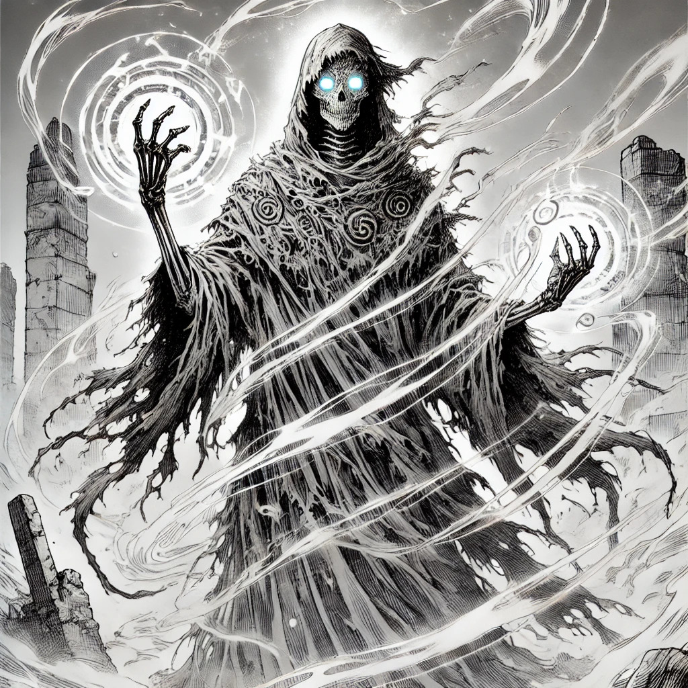

TODO:
- [ ] Separar los contenidos estos en función de si tienen spoilers y son solo para el DJ o no, y son para entregar a los jugadores.
* [ ] Añadir ilustraciones.

# One-Shot: El pueblo sin nombre

*Una aventura de misterio y magia en Warhammer Fantasy*

# Introducción

Este one-shot está diseñado para una experiencia épica dentro del universo de *Warhammer Fantasy*, con un sistema simplificado que mantiene la esencia del juego pero agiliza la narración y el combate.

Presenta un escenario heroico con grandes desafíos, dilemas morales y combates estratégicos.

Se mantiene la esencia de Warhammer, con una mecánica basada en tiradas de dados de 10 caras (**1d10**) y una progresión narrativa flexible.

# Reglas sencillas basadas en las oficiales

## Atributos Básicos

Cada personaje tiene los siguientes atributos:

**Habilidad de Combate (HC):** Para ataques cuerpo a cuerpo y maniobras físicas.
**Precisión (PR):** Para disparos y acciones de puntería.
**Resistencia (R):** Para resistir ataques físicos y condiciones adversas.
**Voluntad (V):** Para resistir efectos mágicos y usar magia.
**Iniciativa (I):** Determina el orden en combate.
**Destreza (D):** Para interacciones detalladas con el entorno y sigilo.

Los valores de estos atributos van de 1 a 10. Un personaje medio tiene 5 en cada atributo, mientras que héroes y villanos importantes pueden llegar a 10.

## Tiradas y Resolución de Acciones

Cuando un personaje intenta una acción con incertidumbre:

**El DJ establece una dificultad** entre 6 (fácil) y 15 (muy difícil).
**El jugador tira 1d10 y le suma el atributo relevante**.
**Si supera la dificultad, tiene éxito**. Si falla, el DJ decide las consecuencias.

Ejemplo de dificultades:

**Fácil (6-8):** Escalar un muro bajo, encontrar una pista evidente.
**Normal (9-11):** Desviar un golpe, engañar a un guardia.
**Difícil (12-15):** Comprender un antiguo hechizo, resistir una magia poderosa.

## Combate Simplificado

El combate se resuelve en **rondas**, siguiendo estos pasos:

**Determinar iniciativa:** Todos tiran **1d10 + I**. Actúan de mayor a menor resultado.
**Ataque:** Se tira **1d10 + HC (cuerpo a cuerpo) o PR (disparos)** contra la **HC o R del enemigo**.
**Defensa:** Si el defensor supera la tirada del atacante con **1d10 + HC o R**, esquiva o bloquea.
**Daño:** Si el ataque impacta, se tira **1d10 + diferencia entre el ataque y la defensa**.

Si el daño es menor que la R del enemigo, es absorbido.
Si iguala o supera la R, el enemigo recibe una herida.

## Puntos de Vida

Los personajes tienen **3-5 puntos de vida**. Los jefes pueden tener hasta **10 puntos de vida**.

## Ejemplo de Combate

Un héroe con **HC 7** ataca a un guardián con **HC 6**.

El héroe tira **1d10 + 7**, sacando un total de 13.
El guardián intenta bloquear con **1d10 + 6**, pero solo obtiene 10.
El ataque impacta con una diferencia de **3 puntos**.
Se tira **1d10 + 3** para el daño. Si supera la resistencia del guardián, recibe una herida.

## Magia Simplificada

Los personajes con habilidades mágicas pueden lanzar hechizos con **1d10 + Voluntad (V)** contra una **Dificultad de Hechizo**.

Ejemplo de hechizos:

**Llamas de la Forja (Dificultad 10):** Proyectil de fuego, **1d10 de daño**.
**Vínculo Estelar (Dificultad 12):** Escudo mágico, bloquea un ataque.
**Destino Escrito (Dificultad 15):** Repite una tirada fallida.

El DJ puede permitir **hechizos improvisados**, aumentando la dificultad según su poder.

## Personajes Jugadores

Cada personaje es un héroe con una psicología compleja y habilidades
únicas.

### 1. El Paladín Caído: Alaric von Greim

**Descripción:** Antiguo caballero del Imperio, condenado por traición que no cometió.
**Motivación:** Redimir su honor y descubrir la verdad.
**Habilidades:** Lucha cuerpo a cuerpo, defensa impenetrable, resistencia mágica.
HC 9 / PR 5 / R 8 / V 7 / I 6 / D 5

### 2. La Hechicera Errante: Lysara de Ulthuan

**Descripción:** Elfa Altísima con un dominio de la magia ancestral.
**Motivación:** Investigar los secretos arcanos de la Forja Celestial.
**Habilidades:** Hechizos devastadores, telequinesis, alteración del tiempo.
HC 5 / PR 6 / R 5 / V 10 / I 8 / D 7

### 3. El Cazador de Bestias: Durgan *Ojos de Halcón*

**Descripción:** Explorador de las tierras salvajes, con un ojo de águila y una puntería letal.
**Motivación:** Hallar la legendaria "Lanza de la Vorágine" en la Forja.
**Habilidades:** Disparo preciso, rastreo, trampas.
HC 6 / PR 10 / R 7 / V 6 / I 9 / D 8

### 4. La Asesina del Crepúsculo: Nyx Valmora

**Descripción:** Sombría asesina, con un pasado lleno de secretos y traiciones.
**Motivación:** Encontrar a la persona que la traicionó dentro de la Forja.
**Habilidades:** Sigilo, venenos, combate dual.
HC 8 / PR 7 / R 6 / V 6 / I 10 / D 9

### 5. El Forjado por la Magia: K'zar el Tiránido

**Descripción:** Criatura sintiente creada con magia arcana, que busca su propósito en el mundo.
**Motivación:** Descubrir su verdadera naturaleza.
**Habilidades:** Adaptabilidad biológica, regeneración, absorción de magia.
HC 8 / PR 6 / R 9 / V 8 / I 5 / D 6

**Voy a concretar los elementos clave de la aventura, estableciendo una
estructura clara, personajes relevantes y un misterio bien definido con
una solución concreta.**

# Introducción

Los personajes llegan a un pueblo imperial **sin nombre**, donde todo parece normal... excepto que **nadie recuerda cómo se llama el lugar**.

Si preguntan, los habitantes contestarán con desconcierto, pero sin angustia:

*"Pues claro, esto es... esto es... espera... no lo sé. Qué raro, nunca lo había pensado."*

El nombre del pueblo **ha desaparecido de todas las inscripciones, mapas y registros**. Al revisar documentos, los jugadores verán tachaduras o espacios en blanco donde debería estar el nombre.

**Algo ha sucedido en este pueblo y depende de los personajes averiguar qué ha sido.**

## 1. El problema: ¿Qué ocurre en el pueblo?

**El pueblo sigue existiendo, pero ha perdido su identidad.**

**No recordar su nombre está teniendo consecuencias reales.**

* **Los archivos imperiales ya no lo reconocen**: Los burócratas creen que no existe y han dejado de enviar suministros y tropas.
* **Las almas de los muertos no pueden ir al Reino de Morr**: Los sacerdotes de Morr sienten que el pueblo es "invisible" para su dios.
* **Los hechizos de localización no funcionan aquí**: Un mago podría tratar de identificar el pueblo, pero el conjuro fallaría.
* **El pueblo está empezando a desaparecer físicamente**:
  * Los letreros de tabernas y negocios han caído, y nadie los ha vuelto a colgar.
  * Algunas casas parecen haber cambiado de dueño... pero nadie recuerda a los antiguos residentes.
  * **La gente que se va del pueblo olvida que alguna vez vivió allí.**

## 2. Investigación: Pistas claves para los jugadores

Los jugadores deben reunir información **hablando con los aldeanos y
revisando registros antiguos**.

### PNJs relevantes

**Padre Gustav (Sacerdote de Morr):**

* Sabe que **el cementerio ha sido afectado**.
* Dice que las lápidas **han perdido sus inscripciones**.
* Está preocupado porque **las almas están atrapadas y no pueden ir al Reino de Morr**.

**Frau Ingrid (Historiadora del pueblo):**

* Ha intentado leer antiguos documentos, pero **todos han perdido referencias al nombre del pueblo**.
* Menciona que **hubo un evento hace 50 años que nadie recuerda bien**.
* Cree que **algo o alguien eliminó el nombre intencionadamente**.

**Hanz el Herrero:**

* Es el único que recuerda un **símbolo extraño** grabado en una piedra en la plaza.
* Dice que los ancianos hablaban de una **"antigua promesa"** que no debía romperse.
* Puede fabricar herramientas especiales si los jugadores necesitan algo.

**Los Fantasmas del Cementerio:**

* No son agresivos, pero **no recuerdan a qué pueblo pertenecieron**.
* Algunos mencionan **"un juramento de sangre"** hecho hace mucho tiempo.
* Uno de ellos **reconoce a un personaje, pero no recuerda de qué lo conoce**.

## 3. ¿Qué sucedió realmente?

Hace 50 años, el pueblo estaba al borde de la destrucción:

Una guerra entre nobles amenazaba con arrasarlo.
Un sacerdote desesperado **realizó un pacto con una entidad olvidada**.
El trato: *el pueblo quedaría oculto de todos los mapas y registros, protegiéndolo para siempre... pero su nombre sería borrado del mundo.*

El problema es que, con el tiempo, la **magia del pacto se ha debilitado**, y ahora el pueblo está en riesgo de **desvanecerse por completo**.

## 4. Resolviendo el misterio: opciones finales para los personajes jugadores

### Opción 1: Recuperar el nombre perdido

Encontrar el **símbolo en la piedra antigua** en la plaza y realizar un ritual de restauración.

* Necesitan la ayuda del sacerdote de Morr y de los fantasmas del cementerio.
* **Consecuencia:** El pueblo recupera su identidad, pero vuelve a ser visible para los conflictos del Imperio.

### Opción 2: Aceptar el olvido y sellar el destino del pueblo

Usar un nuevo ritual para **consolidar la desaparición total** del pueblo.

* Eliminarán **toda memoria del pueblo en quienes lo visitaron, incluyéndose a sí mismos**.
* **Consecuencia:** Se convertirán en los últimos en recordar que el pueblo alguna vez existió.

### Opción 3: Darle un nuevo nombre y crear un destino nuevo

Grabar un **nuevo nombre en la piedra del pacto**.

* Esto crea un **nuevo pueblo con un destino independiente**.
* **Consecuencia:** Algunos eventos del pasado pueden cambiar, y ciertos NPCs pueden no ser los mismos.

### 5. Elementos de Juego y Dificultades

#### Investigación y exploración

* Buscar registros antiguos en la biblioteca (Dificultad 12).
* Interrogar fantasmas en el cementerio (Dificultad 10).
* Descifrar el símbolo en la piedra (Dificultad 15).

#### **Posibles enemigos o peligros:

* **Espectros Guardianes** del pacto, que intentarán evitar que los jugadores rompan el hechizo.
* **Bandidos oportunistas** que han oído rumores sobre el pueblo maldito.
* **Criaturas deformadas** que han aparecido en los límites del pueblo debido a su inestabilidad mágica.

#### Decisión final

El destino del pueblo **depende totalmente de los jugadores**.

# Resumen

**Los habitantes recuerdan su propia identidad:** No hay amnesia masiva, solo la pérdida del nombre del pueblo.

**El problema tiene consecuencias reales:** No es solo una rareza, sino que está afectando el mundo físico y espiritual.

**Hay una historia detrás:** No es un misterio sin sentido, sino el resultado de una elección del pasado.

**Los jugadores tienen libertad total para decidir el destino del pueblo.**

# Material para el Director de Juego

## Introducción

Esta aventura gira en torno a un pueblo imperial cuyo nombre ha sido completamente borrado de la realidad. Los habitantes recuerdan su propia identidad, pero no el nombre del lugar donde viven. Esto ha causado un efecto colateral: el pueblo se está desvaneciendo lentamente de la historia y su existencia es cada vez más inestable. 

El misterio surge de un antiguo **pacto mágico**, realizado hace 50 años para salvar el pueblo de una guerra. La magia se ha debilitado y ahora el pueblo corre el riesgo de desaparecer. Los jugadores deben investigar qué ocurrió y decidir cómo resolverlo.

---

## 1. Claves para dirigir la aventura

### Tono y estilo

* El tono debe ser **misterioso e intrigante**, con momentos de inquietud pero sin terror.
* Los habitantes **no están asustados**, pues han normalizado la situación.
* Se fomenta la **exploración, la interacción y la toma de decisiones con peso narrativo**.

### Elementos centrales

1. **El pueblo es real, pero está perdiendo su conexión con el mundo.**
2. **Los jugadores pueden desentrañar el misterio reuniendo información y uniendo las pistas.**
3. **Existen varias formas de resolver el problema, con consecuencias significativas.**

## 2. Escaleta de la aventura

### Inicio: llegada al pueblo

* Los jugadores llegan al pueblo y notan que falta el nombre en los carteles.
* Los habitantes actúan con normalidad, pero se desconciertan al intentar recordar el nombre.
* Posibles primeras pistas:
  * Los registros están en blanco.
  * Los muertos no pueden ser reclamados por Morr.
  * Algunos edificios han desaparecido sin que nadie lo recuerde.

### Exploración y pistas clave

Los jugadores pueden recopilar información hablando con los PNJs y explorando el pueblo.

#### Personajes y sus conocimientos

* **Padre Gustav (sacerdote de Morr):**
  * Sabe que las lápidas están en blanco y que las almas no pueden abandonar el pueblo.
* **Frau Ingrid (historiadora):**
  * Ha intentado rastrear el nombre en documentos, pero siempre aparecen páginas en blanco.
* **Hanz el herrero:**
  * Recuerda un **símbolo antiguo** en la plaza central, relacionado con una promesa olvidada.
* **Los fantasmas del cementerio:**
  * No son agresivos, pero no pueden recordar su lugar de origen. Algunos murmuran sobre un "juramento de sangre".

### Descubrimiento del origen del problema

Investigando, los jugadores descubrirán que:
* Hace 50 años, un sacerdote realizó un **pacto mágico** con una entidad desconocida.
* La promesa protegió al pueblo de la guerra, pero **a cambio, su nombre fue borrado**.
* La magia del pacto se ha debilitado y ahora el pueblo está desapareciendo poco a poco.

### Posibles conflictos

Para evitar que los jugadores resuelvan el misterio demasiado rápido, introduce desafíos:
* **Espectros guardianes** que protegen la piedra de la promesa.
* **Bandidos imperiales** que buscan saquear el pueblo "fantasma".
* **Inestabilidad en la realidad:** algunos lugares cambian misteriosamente de un día para otro.

### Resolución del misterio

Los jugadores deben decidir qué hacer:
**Recuperar el nombre original** → Restaura la historia, pero hace que el pueblo vuelva a ser visible para el Imperio.

**Dejar que el pueblo desaparezca** → El lugar se desvanecerá, y los jugadores olvidarán que alguna vez existió.

**Dar un nuevo nombre al pueblo** → Cambia el destino del lugar, pero puede traer consecuencias inesperadas.

## 3. Mecánicas y reglas para la aventura

### Pruebas de habilidad clave

* **Investigación (dificultad 10-15):** Para encontrar documentos antiguos o leer runas ocultas.
* **Interacción social (dificultad 8-12):** Para persuadir a los aldeanos y obtener información útil.
* **Resistencia mágica (dificultad 12-16):** Para resistir los efectos del pacto si intentan romperlo.

### Posibles encuentros y desafíos
**Guardianes del pacto:** Espectros que protegen la piedra del pacto.
**Bandidos oportunistas:** Criminales que creen que el pueblo está maldito y buscan saquearlo.
**Muertos atrapados:** Espíritus en pena que desean encontrar su descanso.

### Consecuencias finales
El pueblo cambiará dependiendo de la decisión de los jugadores:
* Si **recuperan su nombre**, todo volverá a la normalidad, pero el Imperio recordará su existencia.
* Si **dejan que desaparezca**, se convertirán en los últimos en recordar que alguna vez existió.
* Si **le dan un nuevo nombre**, el pueblo cambiará, pero podría atraer nuevas fuerzas desconocidas.

## 4. Consejos para el director de juego

**Juega con la incertidumbre:** Haz que los jugadores sientan que el pueblo está deslizándose fuera de la realidad.
**Dale peso a las decisiones:** Cada opción debe tener consecuencias importantes.
**Deja que descubran el misterio a su ritmo:** No les des la solución directamente, sino pistas sutiles.

### Conclusión
"El pueblo que olvidó su nombre" es una aventura de misterio, exploración y elecciones con peso narrativo. Es ideal para jugadores que disfrutan de la investigación y las consecuencias de sus decisiones en el mundo de Warhammer Fantasy. 

**¡Prepárate para una sesión llena de intriga y magia!**

# Batallas estratégicas

## 1. Batalla intermedia: los guardianes del pacto

**Ubicación:** Ruinas antiguas dentro del pueblo, con estructuras medio derruidas y muchas coberturas.
**Enemigos:** Tres espectros guardianes con armaduras etéreas, que solo pueden ser dañados con ataques mágicos o armas imbuidas.
**Estrategia:**
* Los jugadores deben **esconderse y moverse** entre las ruinas para evitar ser rodeados.
* Descubrir que **las runas en el suelo pueden debilitar a los espectros** si son manipuladas correctamente.
* **Objetos del entorno** pueden usarse para hacer ruido y distraer a los enemigos.
* **Los espectros no pueden atravesar ciertas estructuras** que fueron consagradas hace siglos.
* Si los jugadores no usan magia, pueden **buscar un arma sagrada oculta** en las ruinas.

**Condición de victoria:** Derrotar a los tres espectros usando estrategia y el entorno.
**Condición de derrota:** Si los jugadores quedan atrapados y son consumidos por la magia del pacto.

---

## 2. Batalla final: la entidad del pacto

**Ubicación:** La piedra del pacto, un círculo de runas rodeado de grietas dimensionales.
**Enemigo:** Un ser de energía pura con forma cambiante, que adapta sus tácticas a los ataques de los jugadores.
**Estrategia:**
* **Dividir y conquistar:** La entidad puede separar a los jugadores usando ilusiones y ataques psíquicos.
* **Explorar sus debilidades:** Solo es vulnerable en ciertos momentos, cuando la magia del pacto fluctúa.
* **Usar el entorno:** Las grietas dimensionales pueden lanzar energía inestable, dañando tanto a jugadores como al enemigo si son manipuladas correctamente.
* **Coordinación esencial:** Si los jugadores no trabajan juntos, el enemigo se fortalecerá absorbiendo su miedo y dudas.
* **Los jugadores pueden sabotear la piedra del pacto** para debilitar la regeneración del enemigo.
* **El jefe se vuelve más fuerte en la oscuridad**, por lo que encender antorchas mágicas podría ser clave.

**Condición de victoria:** Romper el pacto o vencer al ente antes de que absorba demasiado poder.
**Condición de derrota:** Si el enemigo se fortalece lo suficiente, sellará el destino del pueblo y de los jugadores.

## 3. Recompensas y consecuencias
**Si los jugadores ganan:** El pueblo puede recuperar su nombre o tomar un nuevo rumbo, dependiendo de sus decisiones.
**Si los jugadores pierden:** Quedan atrapados en el limbo de la realidad del pacto, olvidados para siempre.

**Consejo para el director de juego:**
* Fomenta el uso del entorno para incentivar el pensamiento estratégico.
* No hagas que el jefe sea simplemente una bolsa de puntos de vida; dale **fases y adaptabilidad**.
* Usa el tiempo y los efectos del pacto para generar tensión creciente en ambas batallas.

**Este guion está diseñado para que los jugadores piensen, se posicionen bien y usen la creatividad para salir victoriosos.**

# Descubriendo la realidad

Este descubrimiento es progresivo y a veces erróneo.

## 1. Introducción
Para que los jugadores descubran la verdad poco a poco, la información se presentará en fragmentos a través de PNJs, sucesos extraños y pistas dispersas. Algunos elementos serán engañosos o ambiguos, obligándolos a cuestionar lo que realmente está ocurriendo.

## 2. Elementos y personajes clave para el descubrimiento progresivo

### Primera fase: "Algo no cuadra"
**Pistas iniciales que despiertan la curiosidad**
* **Padre Gustav (sacerdote de Morr)**: Les habla del cementerio y de cómo **las lápidas han perdido los nombres de los difuntos**.
* **Carteles y documentos oficiales**: No contienen el nombre del pueblo. En mapas, aparece como "desconocido".
* **Los viajeros forasteros**: No recuerdan haber llegado hasta aquí, como si el pueblo no existiera en sus mentes antes de estar dentro.
* **Las desapariciones extrañas**: Algunos edificios han cambiado, y algunos ancianos aseguran que *“había más casas antes”*, pero nadie puede probarlo.

### Segunda fase: "Algo ocurrió aquí y ha sido borrado"
**Aparición de datos históricos, pero sin conexiones claras**
* **Frau Ingrid (historiadora)**: Muestra documentos con partes en blanco, asegurando que **antes contenían información sobre un evento importante hace 50 años**.
* **Hanz el herrero**: Afirma recordar un símbolo extraño en una piedra en la plaza, pero no puede explicar su significado.
* **Los aldeanos más ancianos**: A veces entran en trance y murmuran sobre un *"juramento de sangre"* y *"el precio de la seguridad"*, pero luego lo olvidan.
* **Al salir del pueblo y volver**: Los PJ sienten un leve mareo y pierden la noción del tiempo por unos segundos.

### Tercera fase: "Hay alguien o algo que nos oculta la verdad"
**Aquí los jugadores pueden empezar a notar que el engaño es intencional**
* **Los fantasmas del cementerio**: No recuerdan su propia muerte ni el lugar donde vivieron.
* **La piedra del pacto**: Un antiguo monolito con símbolos erosionados que parecen *resistirse* a ser leídos.
* **Un PNJ mentiroso**: Un tabernero demasiado insistente en que *"nunca ha pasado nada extraño aquí"*.
* **El Escribano Imperial (engaño deliberado)**: Un forastero que afirma que **el pueblo jamás ha existido en los archivos del Imperio**, sugiriendo que es un lugar maldito.

### Cuarta fase: "El pacto y la desaparición del nombre"
**Los jugadores pueden ahora juntar las piezas y empezar a deducir lo que pasó**
* **Un texto parcialmente restaurado**: Frau Ingrid logra reconstruir parte de un pergamino que menciona un "pacto de sangre para ocultar el pueblo".
* **Los guardianes del pacto**: Espectros que protegen la piedra del pacto y repiten sin cesar: *"Nunca debió ser recordado"*.
* **El altar de la iglesia de Morr**: Oculta una inscripción que se activa con luz de velas, revelando una frase incompleta sobre *"el sacrificio de un nombre"*.
* **Un PNJ que recuerda algo más de la cuenta**: Alguien que dejó el pueblo hace mucho tiempo regresa, **recordando su existencia perfectamente**, lo que contradice la pérdida de memoria general.

### Quinta fase: "La verdad completa y el dilema final"
**Los jugadores descubren toda la historia y deben decidir qué hacer**
* **La piedra del pacto se reactiva**: Si los PJ descubren cómo hacerlo, la piedra **muestra una visión del pasado**, revelando que el pueblo fue salvado de la guerra mediante un sacrificio.
* **La entidad del pacto aparece**: Un ser de energía que asegura que el trato se rompió y ahora *"todo será borrado para siempre"*.
* **El dilema final**: Restaurar el nombre del pueblo, dejar que desaparezca o forjar una nueva identidad.

## 3. Cómo engañar a los jugadores de forma efectiva
**Información sesgada:** Ningún PNJ tiene toda la historia, solo fragmentos.
**Registros alterados:** Documentos con páginas arrancadas, nombres en blanco o tinta desvanecida.
**Eventos extraños:** Lugares que cambian de posición, recuerdos inconsistentes.
**Mentiras parciales:** Algunos NPCs creen versiones erróneas de la historia y las transmiten como verdad.

## 4. Conclusión
Con este sistema de pistas y revelaciones progresivas, los jugadores descubrirán la historia **poco a poco**, enfrentándose a confusión, engaños y giros de guion antes de conocer la verdad y tomar una decisión final sobre el destino del pueblo.

# Antagonista principal: El Heraldo del Olvido
{ width=300px }

**Nombre:** Varghast, el Heraldo del Olvido  
**Origen:** Un antiguo escriba que fue consumido por la magia del pacto y ahora existe como una entidad incompleta, atrapada entre la realidad y el vacío.  
**Apariencia:** Una figura alta y encapuchada, con partes de su cuerpo difuminadas como si no pertenecieran completamente a este mundo. Su rostro es solo una sombra, excepto por unos ojos pálidos que parecen olvidar lo que miran. Viste túnicas desgastadas con inscripciones que desaparecen al ser leídas.  
**Motivación:** Preserva la maldición del pacto y busca borrar el pueblo por completo para sellar su existencia de una vez por todas.  
**Poderes:**  
- **Voz del Olvido:** Con solo hablar, puede hacer que una persona olvide fragmentos de su pasado.  
- **Toque del Vacío:** Cualquier cosa que toca se desvanece progresivamente.  
- **Ilusiones Distorsionadas:** Manipula la percepción de los jugadores, haciéndolos dudar de lo que ven.  

**Frase icónica:** *"Las palabras se desvanecen, los nombres se disuelven… nada que existe debería recordar lo que debe ser olvidado."*  
